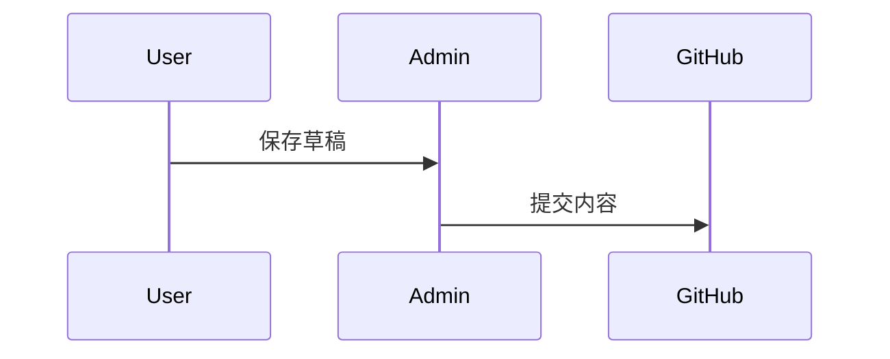

# 功能配置

**入口：后台 → 功能配置**

这一组包含八个子菜单：字体、代码块、文章封面、音乐播放器、评论系统、统计分析、Mermaid 图表和 PlantUML 图表。

## 字体

**入口：后台 → 功能配置 → 字体**  
**手动配置对象：`fontsList`、`fontConfig`**

字体分为“字体定义”和“使用位置”两层。先在字体列表中定义来源，再在字体选择中引用对应的 CSS 变量。

### 字体定义

| 字段 | 说明 |
| --- | --- |
| 名称 | 便于识别的字体名称 |
| CSS 变量 | 以 `--font-` 开头的唯一变量名 |
| Provider | `google`、`fontsource`、`local`、`bunny`、`fontshare` 或 `npm` |
| 字重 | 例如 `400`、`500`、`700` |
| 字形 | 通常为 `normal`，按字体实际能力填写 |
| 子集 | 例如 `latin`、`cyrillic` |
| 回退字体 | 字体加载失败时依次使用 |

本地字体需要为每个变体填写字体资源地址。远程 Provider 会在构建阶段下载并缓存字体，修改后通常需要重新启动开发服务器。

### 字体选择

- **启用自定义字体**：总开关。
- **全局字体**：可以填写多个 CSS 变量；使用 `system` 表示系统字体。
- **横幅主标题字体**、**横幅副标题字体**、**导航标题字体**：留空时跟随全局字体。
- **代码字体**：建议使用等宽字体。
- **本地字体子集化**：构建时扫描站点字符并生成较小的 WOFF2 文件。

```ts
export const fontConfig = {
  enable: true,
  selected: ["system"],
  bannerTitleFont: "--font-zen-maru-gothic",
  bannerSubtitleFont: "--font-inter",
  navbarTitleFont: "",
  codeFont: "--font-jetbrains-mono",
};
```

::: tip 字体加载建议
中文字体文件通常较大。优先使用系统中文字体，或启用本地字体子集化；不要一次加载大量字重和字形。
:::

## 代码块

**入口：后台 → 功能配置 → 代码块**  
**手动配置对象：`expressiveCodeConfig`**

代码块由 Expressive Code 渲染，修改主题或插件设置后需要重新启动开发服务器。

| 设置 | 说明 |
| --- | --- |
| 暗色主题 | 暗色模式使用的代码主题 |
| 亮色主题 | 亮色模式使用的代码主题 |
| 折叠开关 | 长代码是否显示折叠按钮 |
| 行数阈值 | 超过多少行后允许折叠 |
| 预览行数 | 折叠状态显示前几行 |
| 默认折叠 | 长代码是否初始收起 |
| 语言徽章 | 右上角显示语言名称 |
| 语言 Logo | 右下角显示语言图标 |
| Logo 颜色 | `mono`、`original`、`theme` 或自定义颜色 |
| 排除语言 | 指定不显示 Logo 的语言列表 |

## 文章封面

**入口：后台 → 功能配置 → 文章封面**  
**手动配置对象：`coverImageConfig`**

- **文章页显示封面**：不影响文章列表中的封面卡片。
- **标题叠加布局**：把标题和元数据放在文章封面上。
- **显示加载状态**：使用加载动画替代低清预览图。
- **随机封面开关**：允许文章使用 `image: api`。
- **图片 API 列表**：按顺序尝试，全部失败时保留低清预览并显示错误。

随机图片接口会影响构建稳定性和页面一致性，建议至少准备一个稳定的备用服务，并确认接口允许你的使用方式。

## 音乐播放器

**入口：后台 → 功能配置 → 音乐播放器**  
**手动配置对象：`musicPlayerConfig`**

### 通用设置

| 字段 | 说明 |
| --- | --- |
| 导航栏显示 | 在顶部提供播放器入口 |
| 侧边栏显示 | 允许 `music` 侧边栏组件渲染 |
| 模式 | `meting` 在线音乐服务，或 `local` 本地列表 |
| 默认音量 | `0` 到 `1` |
| 播放模式 | `list` 列表循环、`one` 单曲循环、`random` 随机播放 |
| 显示歌词 | 显示 LRC 歌词 |

### Meting 模式

- API 地址可以保留 `:server`、`:type`、`:id` 和 `:r` 占位符。
- 平台支持网易云、QQ 音乐、酷狗等服务，取决于 API 实现。
- 类型可选择单曲、歌单、专辑、搜索或艺术家。
- 备用 API 会在主服务失败时依次尝试。

不要在会被浏览器或公开仓库读取的配置中放入真正的私密凭据。

### 本地模式

每首歌可以设置名称、作者、音频地址、封面和歌词。歌词可以是 LRC 文件地址，也可以直接填写 LRC 文本。

```ts
playlist: [
  {
    name: "歌曲名称",
    artist: "作者",
    url: "/assets/music/song.mp3",
    cover: "/assets/music/cover.webp",
    lrc: "/assets/music/song.lrc",
  },
]
```

## 评论系统

**入口：后台 → 功能配置 → 评论系统**  
**手动配置对象：`commentConfig`**

先在“评论系统类型”中选择一个服务。后台只显示当前服务相关字段；选择 `none` 会关闭全站评论。

### Twikoo

| 字段 | 说明 |
| --- | --- |
| 环境地址 | Twikoo 后端地址 |
| 语言 | 例如 `zh-CN` |
| 访问量 | 是否使用 Twikoo 统计文章访问量 |
| JS 地址 | 可替换为适合访问地区的 CDN |
| CSS 地址 | 可选的自定义样式 |

### Waline

- `serverURL`：Waline 服务地址。
- `emoji`：表情包地址列表。
- `login`：`enable` 允许匿名与登录，`force` 强制登录，`disable` 只允许匿名。
- `visitorCount`：文章访问量统计。

### Giscus

Giscus 基于 GitHub Discussions。需要填写仓库、仓库 ID、分类、分类 ID和映射方式。

- `mapping` 常用 `title`、`pathname`、`url` 等方式。
- `strict` 控制严格匹配。
- `reactionsEnabled` 控制主帖反应。
- `emitMetadata` 控制元数据事件。
- `inputPosition` 可选顶部或底部。
- `loading` 建议使用 `lazy`。

### Disqus

填写站点的 `shortname`。确认站点域名与 Disqus 后台设置一致。

### Artalk

填写 Artalk 服务端地址、语言和访问量统计开关。

::: warning 评论区仍受页面和文章控制
全局启用评论后，动态页、友链页、打赏页和单篇文章仍可以单独关闭评论。
:::

## 统计分析

**入口：后台 → 功能配置 → 统计分析**  
**手动配置对象：`analyticsConfig`**

### 基础服务

- Google Analytics：填写 Measurement ID。
- Microsoft Clarity：填写 Project ID。
- 51.la：填写统计 ID，可选自定义 SDK、数据分离标识、事件分析和录屏。

### Umami

| 字段 | 说明 |
| --- | --- |
| Website ID | Umami 站点标识 |
| 脚本地址 | 支持官方云服务或自建实例 |
| 出站链接 | 是否记录离站点击 |
| Web Vitals | 是否收集浏览器性能指标 |
| 会话回放 | 是否启用录制 |
| 采样率 | `0` 到 `1`，例如 `0.15` 表示 15% |
| 遮罩级别 | `moderate` 遮罩输入框，`strict` 额外遮罩页面文字 |
| 最大时长 | 单次录制时长，单位毫秒 |
| 排除选择器 | 不录制的敏感元素 CSS 选择器 |

启用统计、会话回放或录屏前，请确认当地隐私规则，并在站点隐私说明中如实告知读者。

## Mermaid 图表

**入口：后台 → 功能配置 → Mermaid 图表**  
**手动配置对象：`mermaidConfig`**

Mermaid 代码块在构建时渲染为静态 SVG，并同时生成亮色和暗色主题版本。

- 亮色主题：`editor-light`、`gruvbox-light`、`ayu-light`。
- 暗色主题：`editor-dark`、`one-dark`、`gruvbox-dark`、`ayu-dark`。

文章中使用：

````markdown

````

## PlantUML 图表

**入口：后台 → 功能配置 → PlantUML 图表**  
**手动配置对象：`plantumlConfig`**

| 字段 | 说明 |
| --- | --- |
| 启用 | 关闭后 `plantuml` 代码块退化为普通代码块 |
| 服务器 | PlantUML 服务地址 |
| 亮色主题 | 留空时使用默认外观 |
| 暗色主题 | 可使用 `cyborg` 等 PlantUML 主题 |

使用公共 PlantUML 服务器意味着图表源码可能会发送到第三方服务。包含内部架构、账号或业务机密时，应使用自建服务器。

