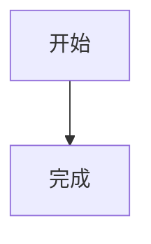
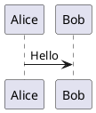

# 发布文章与动态

后台把内容编辑、草稿保存和 GitHub 发布放在同一套流程中。普通文章优先使用后台；只有需要 MDX 组件或高级 Frontmatter 时，再手动编辑。

## 发布文章

**入口：后台 → 发布文章**

页面左侧是 Vditor Markdown 编辑器，桌面端可以分屏预览；右侧用于设置文章路径和展示信息。

| 字段 | 说明 |
| --- | --- |
| 标题 | 必填，建议清楚描述文章主题 |
| 摘要 | 显示在文章卡片和 RSS 中，建议控制在一到两句话 |
| 正文 | 支持 Markdown，保存前会进行必填校验 |
| Slug | 可选；留空时根据标题生成，建议使用小写英文和连字符 |
| 目录 | 可选；用于把文章归入一个子目录，例如 `guide` |
| 分类 | 一篇文章使用一个分类 |
| 标签 | 使用英文逗号分隔多个标签 |
| 封面图片地址 | 可以填写网络 URL、站点绝对地址或相对地址 |
| 发布时间 | 留空时由后台使用当前日期 |

### Slug 建议

- 使用 `my-first-post`，不要使用空格或复杂符号。
- 发布后尽量不要修改，避免旧链接失效。
- 不同文章不要使用相同 Slug。
- 目录只负责组织内容，最终 URL 仍以生成结果为准。

### 保存方式

- 点击“保存草稿”后，文章进入“待提交”，线上博客不会变化。
- 点击“提交到 GitHub”后，后台创建 commit，并等待静态托管平台重新构建。
- 编辑已发布文章时，从“已发布文章”进入，可以继续使用同一表单。

## 手动编写文章

手动创建 Markdown 时，在文件顶部使用 YAML Frontmatter：

```yaml
---
title: 我的第一篇文章
published: 2026-07-30
description: 这是文章的简短摘要
image: ./cover.jpg
tags: [Astro, 博客]
category: 开发
draft: false
---
```

### Frontmatter 字段

| 字段 | 必填 | 说明 |
| --- | --- | --- |
| `title` | 是 | 文章标题 |
| `published` | 是 | 发布日期 |
| `updated` | 否 | 更新日期；未设置时使用发布日期 |
| `description` | 否 | 文章卡片与 RSS 使用的摘要 |
| `image` | 否 | 封面地址，也可使用 `api` 请求随机封面 |
| `tags` | 否 | 标签数组 |
| `category` | 否 | 单个分类名称 |
| `draft` | 否 | `true` 时不向读者展示 |
| `pinned` | 否 | 是否置顶 |
| `lang` | 否 | 文章语言与站点默认语言不同时填写 |
| `author` | 否 | 覆盖默认作者名称 |
| `comment` | 否 | 单独控制当前文章评论，默认开启 |
| `licenseName` | 否 | 覆盖全局许可证名称 |
| `licenseUrl` | 否 | 覆盖全局许可证链接 |
| `sourceLink` | 否 | 文章来源或参考链接 |
| `password` | 否 | 设置文章访问密码 |
| `passwordHint` | 否 | 密码提示 |

::: info 后台覆盖范围
当前后台表单负责标题、摘要、Slug、目录、分类、标签、封面和发布时间。置顶、作者、单篇评论、许可证覆盖、来源链接与文章密码仍需手动设置。
:::

## 封面图片

`image` 支持四种写法：

1. 相对于文章的地址，例如 `./cover.jpg`。
2. 以 `/` 开头的站点公开资源地址。
3. 完整网络地址，例如 `https://example.com/cover.jpg`。
4. `api`，使用“功能配置 → 文章封面”中的随机封面 API。

## Markdown 能力

### 数学公式

行内公式使用单个 `$`，块级公式使用 `$$`：

```markdown
欧拉公式 $e^{i\pi} + 1 = 0$。

$$
\int_{-\infty}^{\infty} e^{-x^2} dx = \sqrt{\pi}
$$
```

### 提醒框

默认支持 GitHub 风格提醒框：

```markdown
> [!NOTE] 提示
> 这里放需要读者留意的信息。

> [!WARNING] 警告
> 这里放可能造成问题的操作。
```

可在“基础配置 → 站点配置”的文章页设置中切换 GitHub、Obsidian、VitePress 或 Docusaurus 风格。启用 Python-Markdown 的 `!!!`、`???` 语法时，建议同时选择 Obsidian 主题。

### Mermaid 与 PlantUML

使用带语言名的代码块：

````markdown



````

主题与服务器设置分别位于“功能配置 → Mermaid 图表”和“功能配置 → PlantUML 图表”。

### GitHub 仓库卡片

```markdown
::github{repo="aozorae/cyrene-blog"}
```

### 剧透文本

```markdown
内容 :spoiler[被隐藏了 **一部分**]。
```

### 视频

可以直接嵌入受信任平台提供的 `iframe`。发布前请确认宽度响应式、来源可信，并避免使用强制自动播放。

## MDX 文章

MDX 允许导入 Astro 或其他前端组件。后台会列出已发布的 MDX，但不适合可视化编辑组件代码；这类文章应在 GitHub 或本地开发环境中维护。

普通内容优先使用 Markdown，只有需要组件、变量或复杂交互时才使用 MDX。

## 发布动态

**入口：后台 → 发布动态**

动态适合简短记录、链接和图片，也支持 Markdown。

1. 填写动态内容。
2. 可选设置发布时间；留空时使用当前时间。
3. 选择“保存草稿”或“提交到 GitHub”。

手动编写动态时，可以使用以下元数据：

```yaml
---
published: 2026-07-30 18:30:00
pinned: true
location: Shanghai
---

今天完成了博客文档整理。
```

“页面 → 动态”负责配置动态页面标题、分页、评论和 Memos 数据源；“发布动态”负责创建具体内容。

